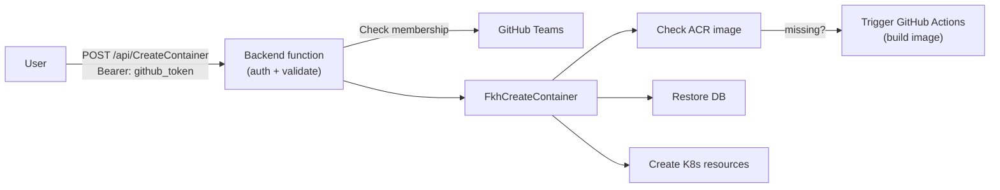
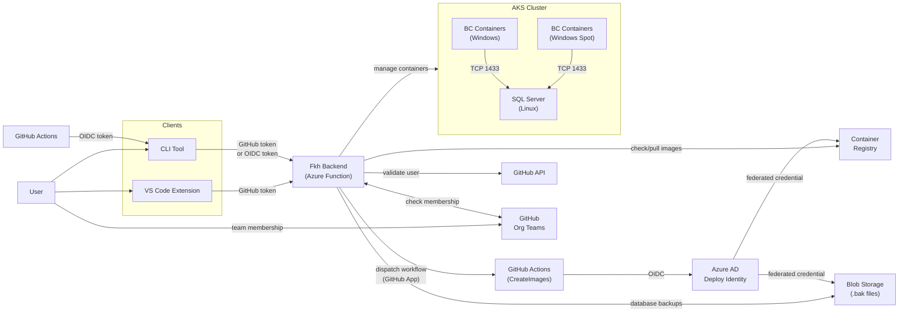

In my [previous post](/2026/07/31/creating-containers-in-vs-code-using-fkh/) I explained how it looks when working with containers in VS Code using [**Fkh - Freddy's Kubernetes Helper**](https://github.com/Freddy-DK/Fkh). This post will explain about the security model of Fkh and why you can trust it for your development processes.

## It's all yours

First of all, Fkh is not hosted by me or any other organization. When using Fkh, it is hosted in your own Azure subscription and your data never leaves your subscriptions.

Secondly, Fkh is Open Source, which prevents you from vendor lock-in and if the product doesn't take the direction you want or you are waiting for functionality you need, you can add this to your own version of Fkh and create a PR.

Lastly, Fkh doesn't store or require any passwords or any humanly created secrets or personal access tokens. Everything in Fkh uses managed identities, federated credentials, just-in-time access. GitHub authentication is used for you to prove who you are and GitHub group memberships are used to define what you have access to.

## GitHub authentication

When configured properly, GitHub authentication is considered secure, and being the leading source code repository for enterprises, I am confident that it will stay like that. Utilizing GitHub authentication for Fkh seemed like the right approach to avoid having to create my own. Also, with the tight integration to AL-Go for GitHub, it was just a no-brainer.

## GitHub authorization

With GitHub handling the authentication securely, how do we then handle authorization in a secure way? The solution implemented in Fkh is that the configuration holds the name of 0+ GitHub teams for supporters, members and admins.

Highest privilege wins - if an authenticated user is not a member of any of the configured groups, they have no access. If an authenticated user is a member of one or multiple groups, they will get the highest privilege.

Supporters will be able to see logs and statuses, Members will be able to see and manage own containers, databases etc., Admins will be able to see and manage all containers, databases, storage etc.

## Request flow for CreateContainer

When a user is creating a container, whether it being from VS Code, the CLI or any other tool, the flow goes like this:

## The security model

As shown in the above diagram, the individual users of Fkh doesn't need access to any Azure resources, nor do they need to be an admin on the computer they are working on. The backend function is the bearer of permissions for handling resources and containers, and users just need to authenticate and provide proof-of-identity using GitHub.

A high level overview of the architecture is here:

As shown in the diagram, access is possible from users or from GitHub actions using federated credentials. In both cases, you specify who and what have access.

All access from code (GitHub actions) are considered admin access and can manage everything.

> **Note:** the diagram shows that all containers use a SQL Server on Linux instead of the built-in SQL Express inside the container. The reason for this is that containers on Kubernetes cannot be stopped. They scale to 0 and are removed, but the database persists.

## SQL Server Developer edition

The SQL Server in the kubernetes cluster is a SQL Server Developer edition, which includes the full feature set (over the SQL Express). Since Fkh is hosted in your own Azure subscription, and only used for development and testing, you are allowed to use this at no license cost.

> **Note:** if I were to host Fkh for other partners and allow them to share a cluster, I would have to pay license costs for the SQL Server as for me, it would be a production setup.

## Just-in-time database access

As the databases resides inside the Kubernetes cluster, you do not have database access from your local PC. Fkh does make it possible for users to get just-in-time access to the database for a limited period of time with a temporary network tunnel and user. More about this later.

## My containers vs. all containers

In VS Code, you will see a list of your containers in the Fkh window. Admins have the ability to click the small see-all icon, to see and manage all containers. More about this later.

## A secure storage account for your pipelines

Fkh also contains a storage account for databases and other files, which can be used for secure file storage with no need for SAS URLs, tokens and secrets - authenticated workflows have access to get what they need. More about this later.

## What's next?

Next posts will be going in more details about the database, the file storage, how to setup Fkh and new functionality implemented or planned.

The current functionality of Fkh is very much the result of one of the customers using Fkh, Bunker Holding Group. My vision and the requirements from Bunker, is what made Fkh what it is today. New functionality in Fkh will very much come from my ideas or from requirements from sponsors and customers.

Stay tuned and feel free to take a look at the project on GitHub: [https://github.com/Freddy-DK/Fkh](https://github.com/Freddy-DK/Fkh) and please consider [sponsoring me](https://github.com/sponsors/Freddy-DK) or setting up a [support service agreement](https://github.com/Freddy-DK/Fkh/blob/main/Support%20Service%20Agreement.md) to keep this project alive and thriving.

Enjoy

_**Freddy**_
