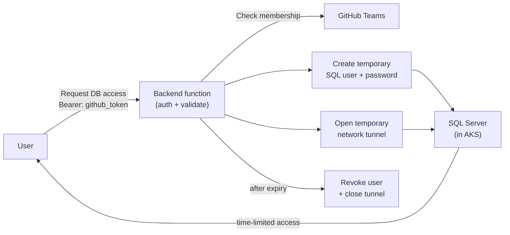

In my [previous post](/2026/08/01/the-security-model-of-fkh/) I explained the security model of [**Fkh - Freddy's Kubernetes Helper**](https://github.com/Freddy-DK/Fkh) and why you can trust it for your development processes. In that post I briefly mentioned just-in-time database access. This post explains what that means and how it works.

## Why you don't have direct database access

As explained in the [security model post](/2026/08/01/the-security-model-of-fkh/), the databases for your containers live on a SQL Server (Developer edition) running inside the Kubernetes cluster in your own Azure subscription. The containers connect to that SQL Server over TCP 1433 from within the cluster.

This is by design. The SQL Server is **not** exposed to the public internet, and you do not have a permanent connection string, username or password on your local machine. There are no standing credentials to leak, rotate or lose.

But sometimes you genuinely need to get into the database - to inspect data, run a query, troubleshoot an issue, or point SQL Server Management Studio (SSMS) or Azure Data Studio at it. That is where just-in-time database access comes in.

## What is just-in-time database access?

Just-in-time (JIT) database access means that instead of having a permanent, always-open door to the database, Fkh opens a temporary, tightly-scoped door only when you need it, and closes it again automatically after a limited period of time.

When you request access, Fkh will:

- Verify who you are using GitHub authentication and check your group membership for authorization.
- If requested, create a **temporary database user** with your GitHub username and the password you specify.
- Open a **temporary network tunnel** into the cluster so your local tools can reach the SQL Server.
- Grant the access for a **limited period of time**, after which the user and the tunnel are removed automatically.

No standing users, no shared passwords, no secrets stored on your machine.

## How to get access form your computer

In VS Code you will need the Microsoft SQL Server extension (or another tool) as well as the Fkh extension. To open a tunnel from your machine to the SQL Server, you need to invoke one of the many commands from Fkh:

Locate the **Allow Sql Access** command and invoke it:

Specify the password you want to use for your temporary user in SQL:

> **Note:** you can also use the Fkh CLI to get access, works exactly the same way. More about this later.

After successfully running the command, the output window displays the IP address of your SQL Connection. Use these info for creating a new connection in the SQL Server extension:

Select the database, create a new query and enjoy access to the database until it is automatically revoked.

## Request flow for database access

The flow for requesting just-in-time database access follows the same pattern as the rest of Fkh - the backend function is the bearer of permissions, and the user just proves who they are with GitHub:

## Authorization for database access

As with everything else in Fkh, authorization is based on your GitHub team membership and the highest privilege wins:

- **Supporters** can see logs and statuses, but do not get database access.
- **Members** can get just-in-time access to the databases of their own containers.
- **Admins** can get just-in-time access to any container's database.

If an authenticated user is not a member of any of the configured groups, they get no access at all.

## Connecting with your tools

Once the temporary user, password and tunnel are in place, you can connect with the tools you already know - SQL Server Management Studio (SSMS), Azure Data Studio, `sqlcmd`, or anything else that speaks TDS - using the connection details Fkh gives you.

Because the access is time-limited, you don't have to remember to clean anything up. When the window expires, the temporary user is dropped and the tunnel is closed automatically. If you need access again later, you simply request it again.

## Why this is a good thing

The just-in-time model gives you the best of both worlds:

- **Security** - there are no permanent credentials, no public database endpoint, and every access is authenticated, authorized, scoped and time-limited.
- **Convenience** - when you need to get into the database, you can, using the tools you already have, without begging anyone for a connection string or a password.

This is the same philosophy that runs through all of Fkh: no humanly created secrets, managed identities and federated credentials for machine-to-machine access, and GitHub authentication plus group membership for people.

## What's next?

One of my ideas is to create a one-click restore of my online Business Central into Fkh, having SQL Server Developer edition in the midst removes the restrictions from SQL Express inside the containers, wouldn't that be cool.

In the coming posts I will go into more detail about the file storage, how to set up Fkh, and the functionality that is implemented or planned.

As always, take a look at the project on GitHub: [https://github.com/Freddy-DK/Fkh](https://github.com/Freddy-DK/Fkh) and please consider [sponsoring me](https://github.com/sponsors/Freddy-DK) or setting up a [support service agreement](https://github.com/Freddy-DK/Fkh/blob/main/Support%20Service%20Agreement.md) to keep this project alive and thriving.

Enjoy

_**Freddy**_
