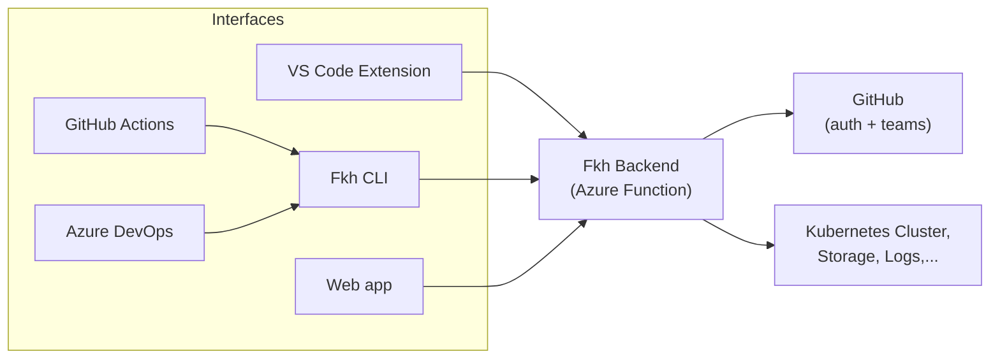

In my [previous post](/2026/08/02/just-in-time-database-access-in-fkh/) I showed how to run backend commands from VS Code using [**Fkh - Freddy's Kubernetes Helper**](https://github.com/Freddy-DK/Fkh). Obviously, VS Code is not the only frontend for Fkh, there is also a Web App and a CLI. Who knows, in the future, there might be other front-ends (MCP is one I have on my mind - for troubleshooting purposes).


## One backend, many interfaces

The most important thing to understand about Fkh is that **all the functionality lives in the backend**. The backend is an Azure Function running in your own Azure subscription - is the single place that authenticates you, authorizes you against your GitHub team memberships, and actually performs the work.

Everything else is just an interface to that backend:

- The **VS Code extension** is an interface.
- The **CLI** is an interface.
- The **Web app** is an interface.

**GitHub Actions** and **Azure DevOps** talks to the same interface typically using the CLI authenticating using federated credentials (OIDC).



This is a deliberate design choice. Because the backend is the bearer of permissions, the interface you happen to use doesn't matter for security - whether you create a container from VS Code, from the CLI, or from a pipeline, the exact same authentication, authorization and validation happens on the backend. The CLI cannot do anything the backend won't allow.

## Installing the CLI

The Fkh CLI is available on NuGet as a dotnet tool and is installed by using:

```pwsh
dotnet tool install|update --global fkh [--prerelease]
```

After installing the CLI, you need to specify backend and GitHub user account, and then you can get the function catalog by writing:


> **Note:** many more functions are available and more functions will be added as needed by partners and customers using Fkh.

Over the coming weeks/months, I will desribe the functionality in Fkh in larger detail.

## But, who needs a CLI?

If most people work in VS Code, why do we need a CLI at all?

As the matter of fact, most people probably won't need to install the Fkh CLI. Admins might want to, but it isn't a requirement for most things.

But, **not everything is interactive**. Pipelines, scheduled jobs, build agents and automation scripts don't open VS Code and click buttons - they run commands. The CLI is built exactly for those scenarios:

- **DevOps pipelines** - spin up a container to run your tests, publish your apps, then tear it down again.
- **Scheduled maintenance** - clean up old containers, refresh databases, prune file versions.
- **Scripting and glue** - combine Fkh operations with everything else you do from a shell.

Because the CLI speaks the same backend as everything else, a container you create from a pipeline is a first-class citizen - you can see it and manage it from VS Code afterwards, and vice versa.

## Authenticating from a pipeline

The one thing a pipeline needs is a way to prove who it is - and Fkh uses GitHub for that, just like it does for humans.

The pipeline needs the **ID_TOKEN: write** permission, which enables OIDC and in GitHub Actions you use **OIDC** with the `--useOIDC` option, which fetches a short-lived token from GitHub Actions and auto-refreshes it. There are **no secrets to store** - no personal access tokens, no passwords, nothing to rotate or leak.

```pwsh
# Inside a GitHub Actions job
fkh listcontainers --useOIDC --asJson
```

Outside of GitHub Actions - for example on a local machine or a self-hosted agent using the GitHub CLI - you can authenticate with your GitHub account using `--ghUser <user>` (or the `GH_USER` environment variable).

The common options you will reach for most often are:

- `--useOIDC` - authenticate using the GitHub Actions OIDC token (pipelines).
- `--ghUser <user>` - GitHub user account for the `gh` auth token (or the `GH_USER` environment variable).
- `--backendUrl <url>` - override the backend URL.
- `--asJson` - output the result as JSON so you can parse it in later steps.
- `--nowait` - don't wait for completion, fire and continue.
- `-h` / `--help` - show help for any command.

## The same commands, everywhere

Most of what you can do in the CLI is also available in VS Code through the **Fkh: Run Command** command. That gives you a menu of the available operations, and it invokes exactly the same backend operations the CLI does.

So the mental model is simple: there is one set of commands, and you pick the interface that fits the moment.

- Working interactively? Use the VS Code extension, or **Fkh: Run Command** for the less common operations.
- Automating? Use the CLI with `--useOIDC` in your pipeline.

You don't have to learn two different tools with two different capabilities - you learn the commands once, and you use them from wherever makes sense.

## Wrapping up

The CLI is a small tool with a big idea behind it: **Fkh is one backend, and the CLI is just one of its faces**. Everything the CLI can do, the backend does, under the same security model as the VS Code extension - and most of it is available in VS Code too through **Fkh: Run Command**.

As always, take a look at the project on GitHub: [https://github.com/Freddy-DK/Fkh](https://github.com/Freddy-DK/Fkh) and please consider [sponsoring me](https://github.com/sponsors/Freddy-DK) or setting up a [support service agreement](https://github.com/Freddy-DK/Fkh/blob/main/Support%20Service%20Agreement.md) to keep this project alive and thriving.

Enjoy

_**Freddy**_
